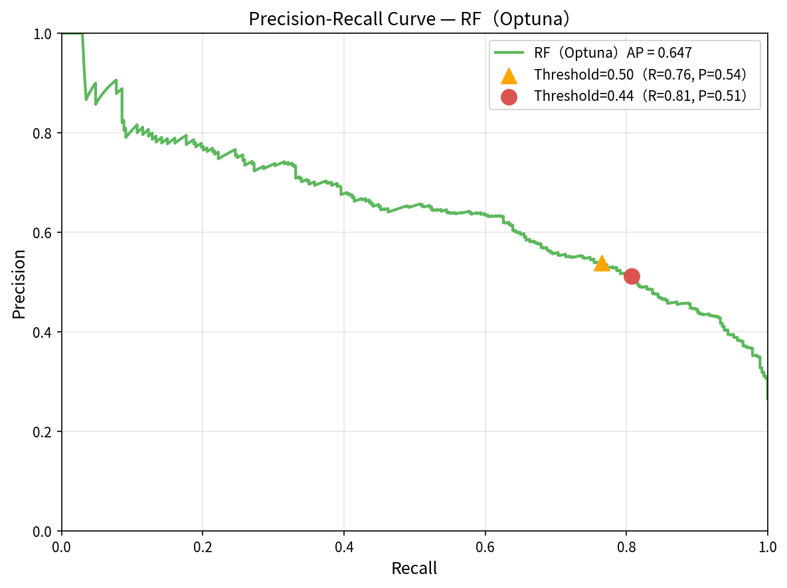
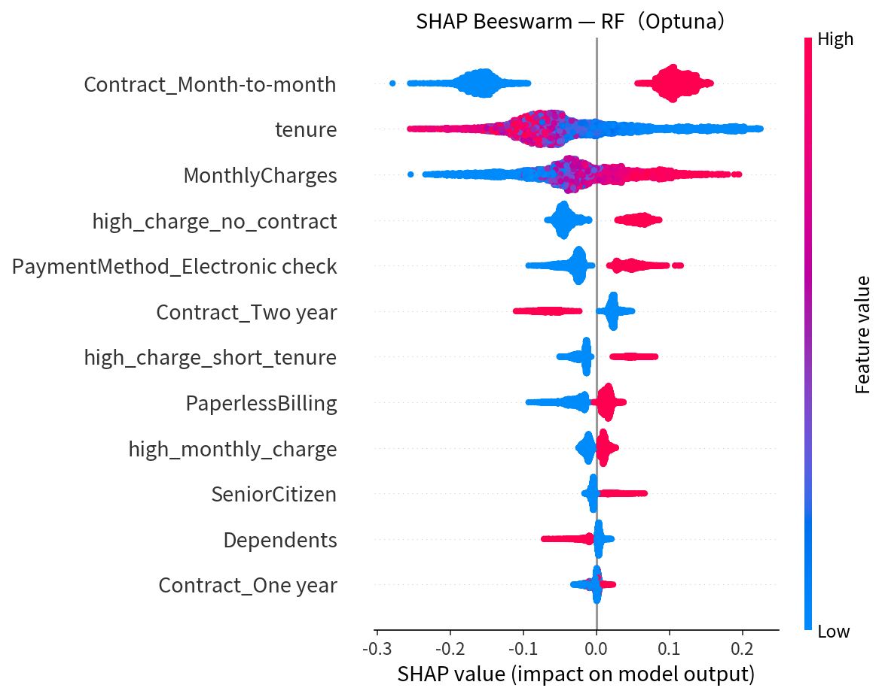

# 📞 Telco Customer Churn Prediction & Explainable Analysis
> Employing a systematic pipeline of StratifiedKFold, class weight adjustment, hyperparameter tuning, and Threshold Tuning to progressively improve churn detection — achieving a Random Forest Churn Recall of **0.807**, with SHAP and LIME integration for interpretable analysis.

🔗 Live Demo: https://telcocustomerchurnproject-tpn5nfeyb5asju7k4uixs4.streamlit.app/

---

## 📌 Project Overview

### 🔹 Background
Customer churn increases **Customer Acquisition Cost (CAC)** and reduces long-term **Customer Lifetime Value (CLV)**. Without an effective mechanism to identify high-risk customers, companies must continuously invest in acquiring new customers, which negatively impacts revenue stability.

### 🔹 Objective
To address customer churn in the telecom industry with a primary focus on improving the model's ability to identify churned customers (**Recall**). Through a four-stage systematic optimization approach, the project builds a predictive model and provides interpretable insights to support targeted retention strategies.

### 🔹 Methods
- Compared **Logistic Regression, Random Forest, and XGBoost**
- Applied **StratifiedKFold, class_weight, Optuna, and Threshold Tuning** for systematic optimization
- Used **F1-score and Precision-Recall Curve** as primary evaluation metrics
- Integrated **SHAP (global explanation) and LIME (instance-level explanation)** for model interpretability

### 🔹 Business Value
Early identification of high-risk churn customers enables business teams to intervene at the right time, supporting data-driven precision marketing and customer retention strategies.

---

## 📊 Dataset

| Item | Details |
|------|---------|
| Source | IBM Telco Customer Churn Dataset (Kaggle) |
| Size | 7,043 customer records, 21 features |
| Target Variable | `Churn` (Yes / No) |
| Class Distribution | Retained 73.5% / Churned 26.5% (class imbalance) |

---

## ⚙️ Modeling Approach

### 1️⃣ Data Preprocessing

- Handled missing values in `TotalCharges` via forced type conversion and zero-fill
- Encoded binary features (Yes/No) as 0/1; applied One-Hot Encoding for multi-class categorical variables
- Encapsulated StandardScaler + OneHotEncoder within a **`Pipeline`** to ensure the scaler is fit only on training data per CV fold, **preventing Data Leakage**

### 2️⃣ Feature Engineering

| Feature | Description |
|---------|-------------|
| `high_monthly_charge` | MonthlyCharges > 70 → 1 |
| `num_core_services` | PhoneService + InternetService count (range 0–2) |
| `high_charge_short_tenure` | MonthlyCharges > 70 AND tenure < 12 months |
| `high_charge_no_contract` | MonthlyCharges > 70 AND Contract = Month-to-month |

### 3️⃣ Four-Stage Systematic Optimization

| Stage | Method | Key Result |
|-------|--------|-----------|
| **① Baseline** | Default parameters for all three models | RF has lowest F1 (0.537) and Recall (0.492) due to overfitting |
| **② Weight Adjustment** | StratifiedKFold + class_weight / scale_pos_weight | LR Recall significantly improved (0.47→0.80); RF shows limited gain due to overfitting |
| **③ Hyperparameter Search** | GridSearchCV / RandomizedSearchCV | Key breakthrough for RF: F1 from 0.529 to 0.618, Recall from 0.476 to 0.751 |
| **④ Fine-Tuning** | Optuna Bayesian optimization + Threshold Tuning | Threshold=0.50: F1=0.632, Recall=0.765; lowered to 0.44: F1=0.629, Recall=**0.807** |

### 4️⃣ Evaluation Metrics

| Metric | Description |
|--------|-------------|
| **Recall** | Ability to identify actual churned customers (primary goal) |
| **Precision** | Proportion of correctly predicted churn customers |
| **F1-score** | Harmonic mean of Precision and Recall (hyperparameter optimization target) |
| **PR Curve** | Evaluates model discrimination ability under class imbalance |

> Since the business priority is to capture as many potential churners as possible while managing resource costs, **F1-score** was used as the hyperparameter optimization target, with **Threshold Tuning** applied afterwards to further maximize Recall.

---

## 📈 Model Performance

### 🔹 Final Model: Random Forest (Optuna-Tuned) + Threshold = 0.44

| Metric | Value |
|--------|-------|
| Churn Recall | **0.807** |
| Churn Precision | 0.515 |
| Churn F1-Score | 0.629 |
| Accuracy | 0.750 |

### 🔹 Three-Model, Four-Version Performance Evolution (X_test, Threshold = 0.50)

| Model | Baseline F1 | StratifiedKFold F1 | SearchCV F1 | Optuna F1 |
|-------|------------|-------------------|------------|----------|
| LR    | 0.538 | 0.614 | 0.613 | 0.614 |
| RF    | 0.537 | 0.529 | 0.618 | **0.632** |
| XGB   | 0.566 | 0.578 | 0.616 | 0.616 |

### 🔹 Precision-Recall Curve (RF Final Model)

### 🔹 SHAP Feature Importance — Beeswarm (RF Final Model)

### 🔹 Key Insights

- **Tenure** is the most critical retention indicator — shorter tenure correlates with higher churn risk; proactive engagement within the first 12 months is recommended
- **Contract type** has a significant impact — Month-to-month customers show the strongest churn tendency; long-term contracts effectively reduce churn risk
- **High monthly charges (> USD 70)** combined with no long-term contract are strongly associated with elevated churn rates
- Lowering the decision threshold to **0.44** improved Recall from 0.765 to **0.807**, with only a 0.003 drop in F1; the threshold can be adjusted in practice based on available resources and risk tolerance

---

## 🔍 Key Findings & Lessons Learned

### 1. Systematic Optimization Matters More Than Model Selection

Rather than pursuing more complex models directly, this project improved performance through a systematic pipeline: StratifiedKFold → class weight adjustment → Hyperparameter Tuning → Threshold Tuning.

The four-version comparison table demonstrates that evaluation design and tuning strategy often have a greater impact on final results than simply switching algorithms.

---

### 2. Feature Engineering Requires Experimental Validation

The `num_core_services` feature was compared across three versions:

| Version | Definition | RF Optuna F1 |
|---------|------------|-------------|
| A (adopted) | `num_core_services`: PhoneService + InternetService (range 0–2) | **0.632** |
| B | Core services + add-on services (9 items total) | 0.632 |
| C | Add-on services only (OnlineSecurity, TechSupport, etc., 7 items) | 0.629 |

Version B matches A, while Version C performs slightly lower. The reason is that add-on services (OnlineSecurity, TechSupport, etc.) are highly correlated with `MonthlyCharges` — more add-on services naturally leads to higher monthly fees — and therefore provide no additional predictive signal. The most parsimonious Version A was adopted as `num_core_services`.

---

### 3. Diminishing Returns in Hyperparameter Tuning

After completing GridSearchCV / RandomizedSearchCV, the additional gains from Optuna were marginal:

| Model | SearchCV CV F1 | Optuna CV F1 | Improvement |
|-------|--------------|-------------|------------|
| LR    | 0.620 | 0.621 | +0.001 |
| RF    | 0.628 | 0.631 | +0.003 |
| XGB   | 0.631 | 0.631 | ≈ 0    |

This suggests that once a model approaches the learnable ceiling of a dataset, more advanced search methods may not yield significant further gains.

---

### 4. Random Forest Showed the Largest Improvement

Random Forest exhibited significant overfitting with default parameters, resulting in poor Recall and F1. After constraining tree depth (`max_depth`), adjusting feature sampling ratio (`max_features`), and applying `balanced_subsample` weighting, X_test F1 improved from Baseline **0.537** to Optuna **0.632** — the largest gain among all three models.

This highlights that model diagnostics and parameter tuning can sometimes matter more than switching to a different algorithm.

---

### 5. Threshold Tuning Delivered Higher-Than-Expected Impact

Compared to Optuna's ~0.003 CV F1 improvement, Threshold Tuning produced a much more meaningful gain in Recall:

| Threshold | Recall | F1 |
|-----------|--------|-----|
| 0.50 (default) | 0.765 | 0.632 |
| 0.44 (business-optimal) | **0.807** | 0.629 |

Sacrificing only 0.003 in F1 yields a substantial improvement in churn detection capability, demonstrating that post-processing is an equally important optimization lever in class imbalance scenarios.

---

### 6. Model Selection Should Be Based on Multi-Dimensional Evaluation

CV F1 scores were nearly identical (RF 0.631 vs XGB 0.631), yet **RF slightly outperformed XGB on the held-out test set** in both Churn F1 and overall Accuracy:

| Dimension | RF | XGB |
|-----------|----|----|
| X_test Churn F1 | **0.63** | 0.62 |
| X_test Accuracy | **0.76** | 0.74 |
| Tuning Time (Optuna, 50 trials) | 582 sec | **230 sec** |
| Deployment Size | Larger | **Smaller** |

> ⚠️ Tuning times are based on local measurements. Actual values vary depending on hardware and search space configuration — intended for relative comparison only.

It is worth noting that if maximizing Recall alone were the goal, XGB (Recall 0.837 at Threshold=0.44) slightly outperforms RF (0.807). However, churn prevention also requires controlling false positives — excessive misclassification wastes limited retention resources. Therefore, **F1-score** was used as the model selection criterion, with **Threshold Tuning** applied at deployment to dynamically balance Recall and Precision.

> Model selection reflects a trade-off in business priorities, not simply the maximization of a single metric.

---

## 🔧 Engineering Challenges & Debugging

During development, several engineering issues were encountered and resolved. These experiences highlight the importance of building reliable ML systems beyond model training alone:

- **Preventing Data Leakage**: Encapsulated preprocessing steps within scikit-learn `Pipeline` to ensure `StandardScaler` fits only on training folds, preventing validation set information from contaminating the scaler's parameters.
- **Fixing a ColumnTransformer Configuration Bug**: Binary features were unintentionally excluded because `passthrough` was not specified in `ColumnTransformer`; corrected to ensure all features were properly passed to the model.
- **Resolving Streamlit Cache Invalidation**: The `get_test_probs` function used an underscore-prefixed parameter `_pipe`, causing Streamlit to skip hashing and the cache to not invalidate on model switch; resolved by using the model name string as the cache key.
- **Fixing Session State Behavior**: Adjusting the Threshold Slider caused the sampled customer record to disappear due to page re-execution; using `st.session_state` to persist the sampled data allows Threshold adjustments to update predictions in real time while retaining the current customer record.

---

## 🚀 Streamlit Interactive Demo

> An interactive web application integrating dynamic prediction, real-time PR curve tracking, and LIME instance-level explanation — showcasing the model's full prediction and interpretability capabilities.

### ⚙️ Global Control Sidebar
- **Model selector**: Switch between LR / RF / XGBoost in real time, synced across all tabs
- **Threshold slider**: Range 0.10–0.90, step 0.01, default set to business-optimal value **0.44**

### 🔹 Tab 1: Project Overview
- Business background and core performance metric cards (Recall, Precision, F1, Accuracy)
- Four-stage optimization methodology summary table
- Dataset preview (first 5 records)
- Three-model, four-version historical performance comparison table

### 🔹 Tab 2: Prediction Analysis (Interactive Core)
- Randomly samples a customer record (Session State ensures data persists across Slider adjustments)
- **Core prediction report**: Actual label | Dynamic prediction with risk level | Key feature values
- **Dynamic PR curve**: Real-time red dot tracking of the current threshold's Precision / Recall coordinates
- **LIME instance explanation**: Top 6 features driving the predicted churn probability for the selected customer

### 🔹 Tab 3: Model Interpretation
- Feature Importance, SHAP Beeswarm, and PR Curve (all from the RF final model)
- Business insights summary: Analysis of three key churn drivers — tenure, contract type, and high monthly charges — with threshold tuning strategy

---

## 🛠 Tech Stack

| Category | Tools |
|----------|-------|
| Data Processing | pandas, numpy |
| Modeling | scikit-learn (Pipeline, ColumnTransformer, StratifiedKFold, GridSearchCV, RandomizedSearchCV, Logistic Regression, Random Forest), XGBoost |
| Hyperparameter Optimization | Optuna |
| Model Interpretation | SHAP (global feature importance), LIME (instance-level local explanation) |
| Visualization | matplotlib, seaborn |
| Model Persistence | joblib |
| Deployment | Streamlit |

---

🔗 **中文版**: [README.md](README.md)
